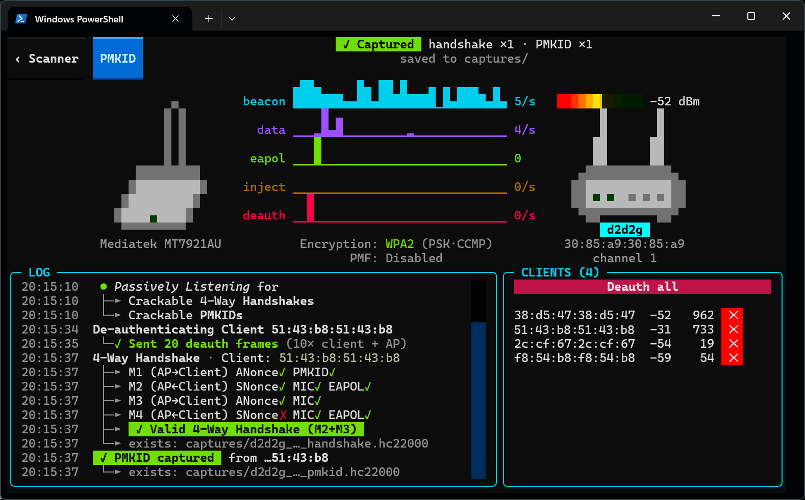

# Wifit3 — Wireless Auditor

A cross-platform, userland Wi-Fi auditing tool with a terminal UI. Wifit3 talks to USB
Wi-Fi adapters **directly over USB** (PyUSB) — no `aircrack-ng`/`airmon-ng`
subprocesses, no Scapy — so it runs the same on **Linux and Windows**.

<p align="center">
  
</p>

## Features

- **Live scan** — APs and clients with channel hopping, signal, encryption,
  WPS state, and WPA3/SAE detection.
- **WPA/WPA2 handshakes** — passive 4-way capture and deauth-triggered capture,
  proper handshake validation, minimalist PCAP saves.
- **PMKID** — passive capture and active harvest, saves as HashCat .hc22000 files.
- **WPS vectors**: Passive/active PushButton invasion, resumable brute-force sessions.
- **WEP suite** — ARP replay, ChopChop, fake auth, PTW key recovery.
- **Live packet dashboard** — real-time per-class sparklines (beacons, data, injects,
  deauths) for the focused target.
- **Cross-platform** — one codebase on Linux and Windows.

## Screenshots

| Scanner | Focus (single target) |
|---|---|
|  |  |

## Supported hardware

| Card | Chipset | Bands |
|---|---|---|
| ALFA AWUS036NHA | Atheros AR9271 | 2.4 GHz |
| ALFA AWUS036ACS | Realtek RTL8821AU | 2.4 / 5 GHz |
| ALFA AWUS036ACH | Realtek RTL8812AU | 2.4 / 5 GHz |
| ALFA AWUS1900 | Realtek RTL8814AU | 2.4 / 5 GHz |
| TP-Link T3U Plus | Realtek RTL8822BU | 2.4 / 5 GHz |
| TP-Link TL-WN722N v2/v3 | Realtek RTL8188EUS | 2.4 GHz |
| ALFA AWUS036ACM | MediaTek MT7612U | 2.4 / 5 GHz |
| ALFA AWUS036ACHM | MediaTek MT7610U | 2.4 / 5 GHz |
| ALFA AWUS036H | Realtek RTL8187L | 2.4 GHz |
| Panda PAU05 / PAU06 | Ralink RT5372 | 2.4 GHz |
| Panda PAU09 N600 | Ralink RT5572 | 2.4 / 5 GHz |
| ALFA AWUS036NH | Ralink RT3070 | 2.4 GHz |
| Buffalo Nintendo Wi-Fi | Ralink RT2500USB / RT2570 | 2.4 GHz |

\* Known limitation — see [VERIFICATION.md](VERIFICATION.md). The absence of an
asterisk means *no known issue*, not that every attack has been verified on that
card — see the matrix for the full per-attack status.

## Thanks

wifit3 only exists because of the people who reverse-engineered and maintained the Linux
drivers we ported from — and who carried this lineage of tools forward.

**Biggest thanks: Christian "kimo" B. ([@kimocoder](https://github.com/kimocoder))** — who
took over **wifite2** when its original maintainer stepped away and has kept it alive and
evolving for years since (and maintains `aircrack-ng`'s RTL8188EUS driver, which we port here).

A few more of the giants whose shoulders we stand on:

- **Nick Morrow** ([@morrownr](https://github.com/morrownr)) — the out-of-tree Realtek USB
  DKMS drivers (RTL8812AU / RTL8814AU / RTL8821AU / RTL8822BU) that keep these cards alive.
- **Stanislaw Gruszka**, **Ivo van Doorn**, and the **rt2x00** team — the Ralink drivers.
- **Lorenzo Bianconi** and **Felix Fietkau** — MediaTek `mt76`.
- **Sujith Manoharan** and the **ath9k** team; **Bitterblue Smith** and the Realtek **rtw88** team.

The full list — every substantive contributor to the drivers we ported, and the cards they
enabled — is in **[CREDITS.md](CREDITS.md)**.

## Philosophy

**Zero dependencies.** Wifit3 implements the whole stack itself — the USB device
drivers (ported from the Linux kernel), 802.11 frame parsing, the crypto, and
the WEP attacks (ported from aircrack-ng) — instead of shelling out to
`airmon-ng`, `aireplay-ng`, `tshark`, or `hcxdumptool`. wifite2 ran a binary
dependency check on every startup; Wifit3 has nothing to check. That's what
keeps it portable and robust: no PATH probing, no scraping another tool's
stdout, no breakage when an external tool changes its output.

**Cross-platform.** The bytes sent to the card are OS-agnostic, so one codebase
runs on **Linux and Windows** — point the adapter at the USB stack Wifit3 talks
through and go. No VM, no Kali boot.

**Userland.** Root/Admin is only required during the one-click setup stage.
After that, Wifit3 can be run without privilege (no sudo, no UAC popups).

**Native and responsive.** No Scapy (it's heavy and triggers a UAC prompt on
every import on Windows); no blocking subprocesses. A Textual TUI that updates
live via async messages — scan, pick a target, attack, save — instead of polling
another process's output.

## Installation

Wifit3 uses [`uv`](https://docs.astral.sh/uv/):

```bash
uv sync
```

**Windows** — Wifit3 installs the **WinUSB** driver for your adapter itself: pick the
card on the splash screen and confirm. The bundled installer self-elevates for that one
step (a single UAC prompt) — no manual Zadig, and you don't run Wifit3 as Administrator.
Then:

```bash
uv run wifit3
```

**Linux** — Wifit3 installs a `udev` rules file to enable userland access to the
supported wireless cards. This is a one-time privileged (root) action. Afterward,
Wifit3 can be run without sudo:

```bash
uv run wifit3
```

If you don't want to install the `udev` rules file, you can still run Wifit3 as root:

```bash
sudo rmmod <kernel_driver>   # e.g. ath9k_htc, rtl8xxxu, mt76x2u, rt2800usb
sudo .venv/bin/python3 -m wifit3
```

## Disclaimer

For use only on networks you own or are explicitly authorized to test.
