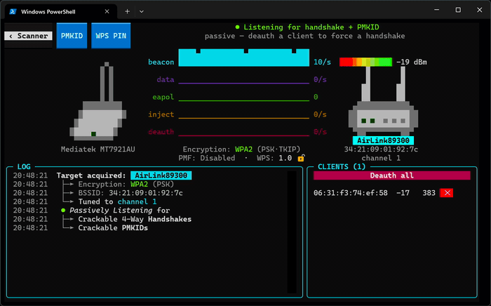
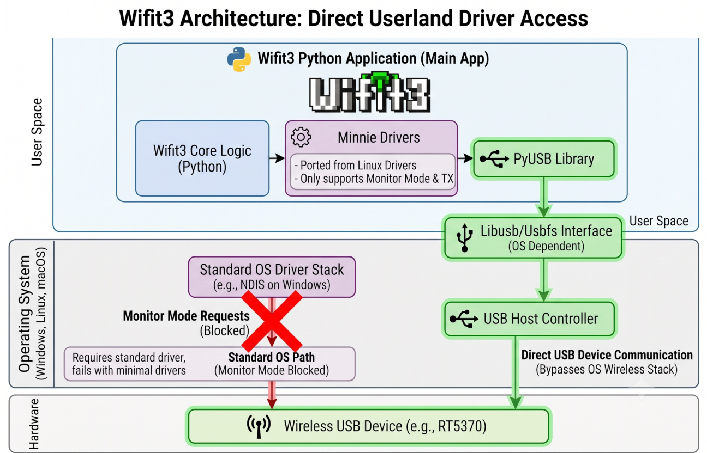

# wifit3: USB Wireless Auditor

A USB-only wireless auditor that runs in userland on Linux and Windows.

<p align="center">
  
</p>

<p align="center">
  
</p>

wifit3 is fundamentally different from its predecessor, [wifite2](https://github.com/derv82/wifite2):

* Only supports certain popular USB cards (see [Supported Hardware](#supported-hardware)).
* Bundles its own driver stack (see [Minnie Drivers](#minnie-drivers)), avoiding headaches with native wireless drivers (Windows NDIS, Linux driver conflicts).
* Talks to wireless cards directly from userland *after* setup.
   * `sudo` is required to set up permissions on Linux (udev/modprobe).
   * Admin is required to install [WinUSB drivers](https://learn.microsoft.com/en-us/windows-hardware/drivers/usbcon/introduction-to-winusb-for-developers) on Windows (automated).
   * After setup/install, wifit3 runs without priviledge escalation.
* *Far* fewer dependencies: PyUSB/libusb (USB) and Textual/Rich (TUI).
  * No aircrack/airmon/reaver/bully/hcxdumptool/etc.

## Features

- **Live scan**: Lists Access Points (APs) with channel hopping, signal, encryption, WPS state, and WPA3/SAE detection.
- **PMKID**: passive capture and active harvest, saves as HashCat `.hc22000` filetype.
- **WPA/WPA2 handshakes**: passive 4-way capture and deauth-triggered capture, proper handshake validation, compact PCAP and `.hc22000` saves.
- **WPS PIN Brute-force**: Resumable WPS PIN brute-force sessions.
- **WPS PushButton Extraction**: Detects when an AP's WPS button is pressed, automatically extracts PSK.
- **VAP Decloaking**: Identifies and tags hidden Virtual APs (VAPs) with its physical AP.
- **WEP suite**: ARP replay, ChopChop, fake auth, PTW key recovery.
- **Live packet dashboard**: real-time traffic sparklines (beacons, data, injects, deauths) for the focused target.

## Screenshots

| Scanner | Focus (single target) |
|---|---|
|  |  |

## Supported hardware

Only the devices listed below will work with wifit3.

*If your USB device is not listed there, wifit3 will not work with it.*

| Card | Chipset | Bands |
|---|---|---|
| ALFA AWUS036**NHA** | Atheros AR9271 | 2.4 GHz |
| ALFA AWUS036**ACM** | MediaTek MT7612U | 2.4 / 5 GHz |
| ALFA AWUS036**ACHM** | MediaTek MT7610U | 2.4 / 5 GHz |
| ALFA AWUS036**AXML** / Panda PAU0F | MediaTek MT7921AU | 2.4 / 5 GHz |
| ALFA AWUS036**ACS** | Realtek RTL8821AU | 2.4 / 5 GHz |
| ALFA AWUS036**ACH** | Realtek RTL8812AU | 2.4 / 5 GHz |
| ALFA AWUS1900 | Realtek RTL8814AU | 2.4 / 5 GHz |
| ALFA AWUS036**H** | Realtek RTL8187L | 2.4 GHz |
| ALFA AWUS036**NH** | Ralink RT3070 | 2.4 GHz |
| TP-Link T3U Plus | Realtek RTL8822BU | 2.4 / 5 GHz |
| Auscoumer 600 Mbps | Realtek RTL8821CU | 2.4 / 5 GHz |
| TP-Link TL-WN722N v2/v3 | Realtek RTL8188EUS | 2.4 GHz |
| Panda PAU05 / PAU06 | Ralink RT5372 | 2.4 GHz |
| Panda PAU09 N600 | Ralink RT5572 | 2.4 / 5 GHz |
| Buffalo Nintendo Wi-Fi USB Controller | Ralink RT2570 | 2.4 GHz |
| LOTEKOO 150 Mbps | Ralink RT5370 | 2.4 GHz |

[VERIFICATION.md](VERIFICATION.md) has detailed information about each card's capability and performance.

## Install

Wifit3 uses [`uv`](https://docs.astral.sh/uv/) (requires internet access to pull dependencies for the first run):

```
uv sync
uv run wifit3
```

**Windows**: Wifit3 offers to install the **WinUSB** driver for your device. The bundled installer
self-elevates for that one step (a single UAC prompt), after which no Administrator privileges are needed to run Wifit3.

**Linux**: Wifit3 offers to create udev and modprobe rules which enable userland access. These rules blocklist 
the card's kernel driver (so the kernel stops grabbing it). Afterward Wifit3 runs without `sudo`.

### Uninstall

Click the red ` x ` button on Wifit3's Splash screen to uninstall
* **Windows:** Uninstalls WinUSB driver, relinquishing control to Windows' installed driver.
* **Linux:** Deletes udev & modprobe rules, kernel assumes control of the driver after a replug.

## Thanks

Wifit3 only exists because of the people who reverse-engineered and maintained the Linux
drivers we ported from.

**Biggest thanks: Christian "kimo" B. ([@kimocoder](https://github.com/kimocoder))**, who
took over **wifite2** when its original maintainer (me) stepped away and has kept it alive and
evolving for years since (and maintains `aircrack-ng`'s RTL8188EUS DKMS driver, which we port here).

**Special thanks: Sandman**, close friend and the master to my Linux & wireless-hacking apprenticeship.

A few more of the driver authors we ported from:

- **Nick Morrow** ([@morrownr](https://github.com/morrownr)) — the out-of-tree Realtek USB
  DKMS drivers (RTL8812AU / RTL8814AU / RTL8821AU / RTL8822BU) that keep these cards alive.
- **Stanislaw Gruszka**, **Ivo van Doorn**, and the **rt2x00** team — the Ralink drivers.
- **Lorenzo Bianconi** and **Felix Fietkau** — MediaTek `mt76`.
- **Sujith Manoharan** and the **ath9k** team; **Bitterblue Smith** and the Realtek **rtw88** team.

The full list (every substantive contributor to the drivers we ported, and the cards they
enabled) is in **[CREDITS.md](CREDITS.md)**.

## Minnie Drivers

wifit3 talks to the wireless cards directly via USB using its built-in "Minnie Drivers":
miniature userland ports of the Linux drivers. The "miniature" is because we do not port STA mode (client)
nor AP mode; just the bare minimum needed to get RX and TX working in Monitor Mode.

<p align="center">
  
</p>

Talking to the wireless card in this way bypasses the operating system's wireless driver stack entirely,
including Windows' NDIS (Network Driver Interface Specification), which would otherwise prevent
functionality such as Monitor Mode and injection. And because the bytes sent to the card are the
same regardless of OS, one codebase runs on both Linux and Windows.

### Driver Porting with Coding Agents

The Minnie Drivers were ported from C to Python by a coding agent, not
by hand. I wanted to learn how to use LLMs, and porting Linux drivers to Python is a good use-case for coding agents.

The coding agent has a test harness which replays USB instructions (coming to/from the Linux driver) byte-for-byte
against the ported driver. The test harness ensures the ported driver behaves identically to the Linux driver
*in the captured scenario* (device bringup, `airmon-ng start`, `airodump-ng` channel hops, `aireplay-ng` injections).

#### Test Harness for Agents

[The porting process](docs/porting/) (docs) explains how agents are able to safely port Linux drivers to Python.

A brief summary:

1. User captures USB traffic on a Linux machine that has the target wireless driver installed and running 
(along with `airmon-ng` and `aircrack-ng`).
   * [capture.py](https://github.com/derv82/wifit3/blob/master/src/wifit3/scripts/capture.py) is an automated 
   script that executes the necessary commands on Linux while capturing all USB traffic.
   * This script also extracts the Linux driver source code.
2. User ask the agent to port the driver with the `/port` command, e.g. `/port rt5370` (Claude-specific).
3. Agent asks for the location of the captured traffic (.pcap and .log files) and the driver's C source code.
4. Agent updates the pcap-replay test harness (see [verify_pcap.py](https://github.com/derv82/wifit3/blob/master/scripts/verify_pcap.py)) 
so the new driver can be tested offline for correctness against the captured USB traffic.
5. The loop:
   * `verify_pcap.py` provides the *next* USB instruction (bytes) which the ported driver's output diverges from the capture.
   * Agent uses the source code & next USB instruction to port the driver byte-by-byte.
5. Once the driver is complete and proven correct offline, Agent tests live on real hardware (card plugged in), troubleshoots and iterates.

## License

Wifit3 is licensed under the **GNU General Public License v2.0** (GPL-2.0-only): see
[LICENSE](LICENSE). The userland drivers are ports of GPLv2 Linux kernel and vendor DKMS
drivers, so GPLv2 is the natural fit; the upstream authors are credited in [CREDITS.md](CREDITS.md).

**Source for binary releases.** The prebuilt executables on the Releases page are built from
this repository. The complete corresponding source for any released binary is this repository
at its matching version tag. GPLv2 §3 is satisfied by offering source from the same place the
binary is offered.

**Firmware is not GPL.** The vendor firmware blobs that Wifit3 loads onto the cards are
redistributed verbatim under their own manufacturers' licenses (Realtek / MediaTek / Ralink),
*not* the GPL. Each ships with its license text alongside it; provenance and byte-verification
are documented in [FIRMWARE.md](FIRMWARE.md).

## Disclaimer

For use only on networks you own or are explicitly authorized to test.

⚠️ **Hardware-damage risk.** Wifit3 talks to USB Wi-Fi hardware at the register level, with no
kernel driver between it and the silicon. A bad register write, firmware page, or power sequence
can damage or permanently disable ("brick") a device. **Use at your own risk: there is no
liability for hardware damage.**
