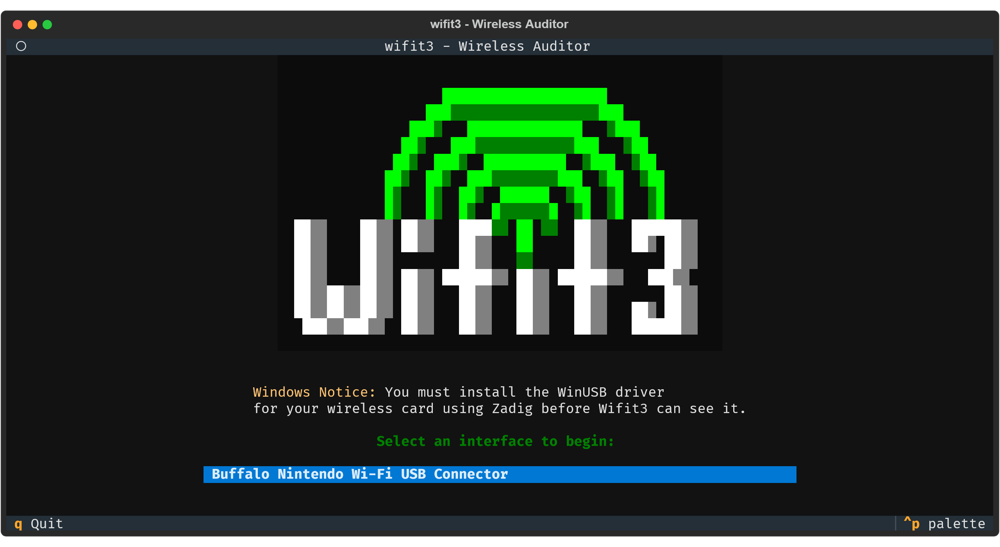
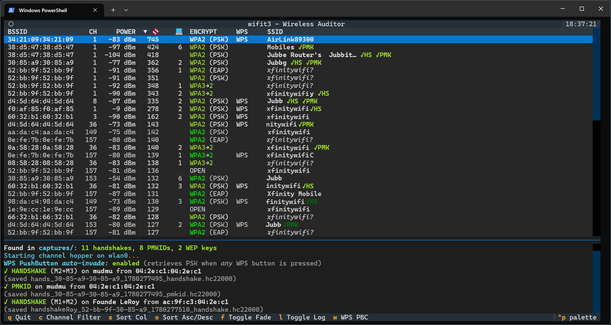
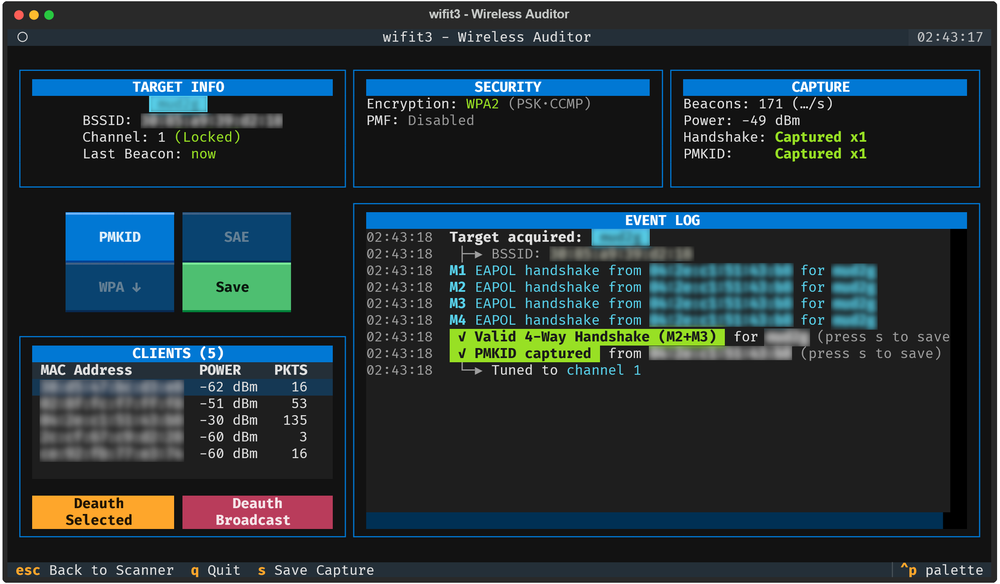

# Wifit3 — Wireless Auditor

A userland Wi-Fi auditing tool with a terminal UI. Wifit3 talks to USB Wi-Fi
adapters **directly over USB** (PyUSB) — no `aircrack-ng`/`airmon-ng`
subprocesses, no Scapy — so it runs the same on **Linux and Windows**.

<p align="center">
  
</p>

## Features

- **Live scan** — APs and clients with channel hopping, signal, encryption,
  WPS state, and WPA3/SAE detection.
- **WPA/WPA2 handshakes** — passive 4-way capture and deauth-triggered capture,
  paired per-association so you don't save uncrackable junk.
- **PMKID** — passive capture and active harvest.
- **WEP suite** — ARP replay, ChopChop, fragmentation, fake auth, PTW key recovery.
- **WPA3/SAE probing** — including the Dragonblood-relevant groups.
- **Export** — `hashcat -m 22000` hashlines and `.pcap`, ready to crack.
- **Cross-platform** — one codebase on Linux and Windows.

## Screenshots

| Scanner | Focus (single target) |
|---|---|
|  |  |

## Supported hardware

| Card | Chipset | Bands |
|---|---|---|
| ALFA AWUS036NHA | Atheros AR9271 | 2.4 GHz |
| ALFA AWUS036ACS | Realtek RTL8821AU | 2.4 / 5 GHz |
| ALFA AWUS036ACH | Realtek RTL8812AU | 2.4 / 5 GHz |
| TP-Link T3U Plus | Realtek RTL8822BU | 2.4 / 5 GHz |
| TP-Link TL-WN722N v2/v3 | Realtek RTL8188EUS | 2.4 GHz |
| ALFA AWUS036ACM | MediaTek MT7612U | 2.4 / 5 GHz |
| ALFA AWUS036ACHM | MediaTek MT7610U | 2.4 / 5 GHz |
| (various) | Realtek RTL8187 | 2.4 GHz |
| (various) | Ralink RT2800USB (RT5372 / RT5572) | 2.4 / 5 GHz |
| Buffalo Nintendo Wi-Fi USB Connector | Ralink RT2500USB / RT2570 | 2.4 GHz |

## How it differs from wifite / wifite2

- **No external tools.** Wifite drives `airmon-ng`, `aireplay-ng`, `tshark`, etc.
  as subprocesses. Wifit3 implements the monitor mode, injection, 802.11
  parsing, and crypto itself, straight over USB.
- **Runs on Windows**, not just Linux — bind the adapter to WinUSB with Zadig
  and go (no kernel driver, no VM).
- **A TUI**, not a scripted CLI — scan, pick a target, attack, save.

## Installation

Wifit3 uses [`uv`](https://docs.astral.sh/uv/).

```bash
uv sync
uv run python -m wifit3
```

**Linux** — unload the kernel driver so Wifit3 can claim the adapter:

```bash
sudo rmmod <kernel_driver>   # e.g. ath9k_htc, rtl8xxxu, mt76x2u, rt2800usb
```

**Windows** — install the **WinUSB** driver for your adapter with
[Zadig](https://zadig.akeo.ie/) first; Wifit3 won't see it otherwise.

## Disclaimer

For use only on networks you own or are explicitly authorized to test.
