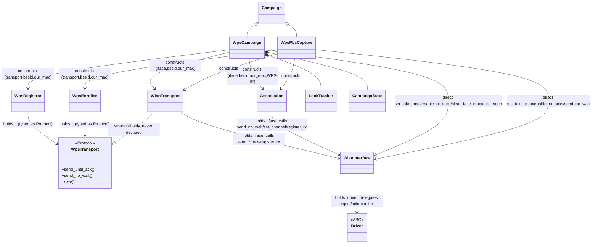
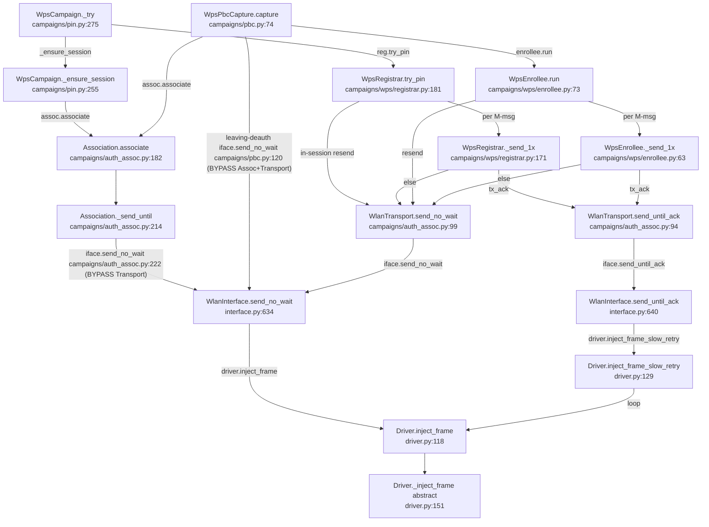

# WPS Attack Subsystem: Architecture Recon

Reconnaissance only (dated 2026-07-17). Maps the class structure, dependencies, `inject_frame`
call chains, state duplication, and code smells across the WPS attack path. No fixes proposed.
Scope: `src/wifit3/campaigns/{auth_assoc.py, campaign.py, pin.py, pbc.py, wps/*}`, `wlan/interface.py`,
`chips/driver.py`. Citations are `file:line` relative to `src/wifit3/`.

---

## 1. Class inventory

- **`Campaign` (base)** — `campaigns/campaign.py:27`. Radio-owning attack base; class-level
  `active` slot is the single-radio mutex; owns run/stop/teardown so subclasses write only
  `_loop()` + `teardown()`. Fields: class attrs `active`/`button_id`/`key`/`hotkey`/`stoppable`
  (`:35-49`); instance `ap`, `iface`, `stopped`, `_task` (`:51-55`).
- **`WpsCampaign(Campaign)`** — `campaigns/pin.py:97`. Focus-facing PIN brute-force orchestrator:
  two-halves sweep, lock/backoff, `.run` resume persistence, ETA, per-attempt logging. Its own
  docstring lists 5 responsibilities (`:6-11`) — a god object. Holds `target`/`bssid`(str)/
  `channel`, `our_mac`, `assoc`, `transport`, ACK flags `_tx_ack`/`_ack_resends`/`_ap_ever_acked`/
  `_ap_sends_nacks`, `lock: LockTracker`, `state: CampaignState`, plus ~10 scratch fields
  (`:123-176`).
- **`WpsPbcCapture(Campaign)`** — `campaigns/pbc.py:47`. Fire-once opportunistic PBC PSK capture;
  associates as Enrollee and runs `WpsEnrollee`.
- **`WpsRegistrar`** — `campaigns/wps/registrar.py:131`. Transport-agnostic per-PIN EAP/WSC state machine
  (external Registrar vs AP-as-Enrollee); drives the split-PIN attack. Knows no USB. Per-attempt WSC
  state (keys, nonces, `highest_mt`, `last_sent`) lives as **locals** in `try_pin` (`:184-202`) —
  the one place state is kept cleanly.
- **`WpsEnrollee`** — `campaigns/wps/enrollee.py:32`. Mirror-polarity WSC machine for PBC (we build
  M1/M3/M5/M7, PSK arrives in M8). Same transport contract as the registrar.
- **`WpsTransport` (Protocol)** — `campaigns/wps/registrar.py:34`. A structural `typing.Protocol`
  (`send_until_ack`/`send_no_wait`/`recv`). NOT a real base class; `WlanTransport` satisfies it by
  shape only.
- **`Association`** — `campaigns/auth_assoc.py:120`. Open-System auth + Assoc Request against one AP;
  appends caller-supplied `assoc_trailer_ies` (the WPS vendor IE).
- **`WlanTransport`** — `campaigns/auth_assoc.py:58`. Adapts a `WlanInterface` to the send/recv/drain
  contract; RX via an `asyncio.Queue` fed by a registered callback that keeps only AP→us frames.
- **`WlanInterface`** — `wlan/interface.py:125`. Device-agnostic 802.11 abstraction the UI and
  attacks talk to: AP/client registry, channel hopping, raw-frame injection through a chip
  `Driver`.
- **`Driver` (ABC)** — `chips/driver.py:39`. The contract every `chips/*/driver.py` implements;
  the frame-injection bottom + the ACK tally (`_ack_detect_on`/`_our_tx_macs`/`_ack_counts`,
  `:79-81`).

---

## 2. Dependency graph

Construction sites: UI Focus builds `WpsCampaign(iface, ap, log=…)` (`ui/screens/focus_v2/screen.py:959`)
and `WpsPbcCapture` (`:1008`, `ui/screens/scanner.py:831`). `WpsCampaign._ensure_session` builds
`Association` (`campaigns/pin.py:264`) + `WlanTransport` (`:269`); `._try` builds `WpsRegistrar` (`:282`).

`WpsTransport` is only a type hint on `WpsRegistrar.t` / `WpsEnrollee.t`. `WlanTransport` implements
the shape but never declares `class WlanTransport(WpsTransport)` and there's no `@runtime_checkable`.
The `..|>` above is a convention the code never states.

---

## 3. The `inject_frame` / TX call chain

Bottom: `Driver._inject_frame` (abstract per-chip bulk-OUT, `driver.py:151`), reached via
`Driver.inject_frame` (`:118`) or `Driver.inject_frame_slow_retry` (`:129`, loops calling
`self.inject_frame` at `:140`). `WlanInterface` is the only caller of the Driver TX methods
(`interface.py:638`, `:645`). Above it, **five distinct routes** reach down; paths via
`Association` and both campaigns' direct pokes bypass `WlanTransport`.

Adjacent ACK/monitor plumbing also bottoms out in `Driver`: `iface.enable_rx_acks`
(`campaigns/pin.py:418`) → `driver.enable_rx_acks`; `iface.set_fake_mac` (`campaigns/pin.py:261`, `campaigns/pbc.py:82`)
→ `driver.enter_active_monitor`; `iface.acks_seen` (`campaigns/pin.py:463`) → `driver.acks_seen`.

---

## 4. State duplication

| State | Copies (class.field @ file:line) |
|---|---|
| **our_mac** | `WpsCampaign.our_mac` `campaigns/pin.py:129`; `Association.our_mac` `campaigns/auth_assoc.py:133`; `WlanTransport.our_mac` `:63`; `WpsRegistrar.our_mac` `campaigns/wps/registrar.py:151`; `WpsEnrollee.our_mac` `campaigns/wps/enrollee.py:49`; `WpsPbcCapture.our_mac` `campaigns/pbc.py:58`. Plus `Driver._our_tx_macs` `driver.py:80` and `WlanInterface.forged_macs`/`self_macs` `interface.py:151,155`. Threaded into 6 objects; rebuilt each re-assoc. |
| **bssid** | str in `WpsCampaign`/`Association`/`CampaignState`; bytes in `WlanTransport`/`WpsRegistrar`/`WpsEnrollee`; `WpsCampaign` re-derives `str_to_mac(self.bssid)` inline at `campaigns/pin.py:261,263,269,282`. |
| **channel** | `WpsCampaign.channel`, `Association.channel`, `WpsPbcCapture.channel`, `AccessPoint.channel`/`WlanInterface.current_channel`. |
| **ACK tracking** | Truth: `Driver._ack_detect_on`/`_ack_counts`/`_our_tx_macs` `driver.py:79-81`. Re-exposed via `WlanInterface.acks_seen`/`enable_rx_acks`. Derived flags `WpsCampaign._ap_ever_acked`/`_ap_sends_nacks`. TX-ACK config duplicated 3 layers: `WpsCampaign._tx_ack`/`_ack_resends` → `WpsRegistrar.tx_ack`/`ack_resends` → same in `WpsEnrollee`. |
| **lock state** | `LockTracker.strikes`/`locked_since` `campaigns/wps/lock.py:31-33` (real); `WpsCampaign._lock_kind`/`_lock_end_at`/`_consecutive_locks_no_progress` `campaigns/pin.py:154-156` (UI mirror); `AccessPoint.wps_locked` (beacon). Three sources feed one decision at `campaigns/pin.py:439`. |
| **last-sent frame** | `WpsRegistrar._last_1x_frame` `campaigns/wps/registrar.py:169`; `WpsEnrollee._last_1x_frame` `campaigns/wps/enrollee.py:58`. |
| **should_stop** | One source (`Campaign.stopped`) wrapped as a fresh lambda into `Association`/`WpsRegistrar`/`WpsEnrollee`. |

---

## 5. Code smells (catalog only)

- **Nested `def` inside async method inside class:** `WpsRegistrar.try_pin` → `def _out(...)`
  `campaigns/wps/registrar.py:204`; `WpsEnrollee.run` → `def once(...)` `campaigns/wps/enrollee.py:91` + `def phase(...)` `:100`.
- **Instance fields as cross-method scratch:** `WpsCampaign` `_last_attempt_sig`, `_lock_kind`/
  `_lock_end_at`, `_timeout_retries`, `_ap_sends_nacks`, `_attempt_ewma`, `status`, `fail_reason`
  all written/read across `_loop`/`_handle_lock`/`_apply_outcome`/`_log_attempt`. `Association`
  `_auth_ok`/`_assoc_ok` written in the `_rx_cb` callback (`:237,242`) and read in `associate`.
- **Protocol that should be a class:** `WpsTransport` `campaigns/wps/registrar.py:34` vs `WlanTransport`
  `campaigns/auth_assoc.py:58`; the two `_send_1x` impls (`campaigns/wps/registrar.py:171`, `campaigns/wps/enrollee.py:63`) are
  near-identical duplicates.
- **Constructor-injected deps re-threaded every attempt:** each per-PIN attempt reconstructs
  `Association` + `WlanTransport` + `WpsRegistrar` (`campaigns/pin.py:264-282`), re-wiring the same
  iface + MAC three times.
- **Long methods / god objects:** `WpsRegistrar.try_pin` `:181-356` (~175 lines);
  `WpsEnrollee.run` `:73-220` (~147 lines); `WpsCampaign._loop` `:415-513` (~100 lines).
- **Logging tangled into control flow:** two channels — an injected UI activity-log callback
  `self.log` (defaults differ per class: `logger.info` vs `logger.debug`) and the module logger.
  `self.log(...)` calls are interleaved between protocol steps, and engine strings bake rich-markup
  color tags (`[red]…[/red]`) despite `Campaign`'s docstring claiming "Engine-pure: no Textual".

---

## 6. Map of the swamp

Intended layering: UI constructs a `Campaign` → drives a transport-agnostic WSC machine
(`WpsRegistrar`/`WpsEnrollee`) speaking only the `WpsTransport` shape → `WlanTransport` is the one
adapter touching `WlanInterface` → `WlanInterface` is the 802.11 abstraction → `Driver` is the chip
→ USB is the floor. In practice the boundaries leak in three spots: (1) `Association` sits parallel
to `WlanTransport` and reaches straight to `WlanInterface.send_no_wait` (`campaigns/auth_assoc.py:222`); (2)
both campaigns skip past the registrar and transport to poke `WlanInterface` directly for
`set_fake_mac`/`enable_rx_acks`/`clear_fake_mac`/`acks_seen`, and `WpsPbcCapture` injects its
leaving-deauth with no protocol object between it and the interface (`campaigns/pbc.py:120`); (3) identity
state (`our_mac`, `bssid`, `tx_ack`, `should_stop`) is copied into six objects and re-threaded on
every per-PIN rebuild rather than owned once, and the "transport-agnostic" state machines are
coupled back to the campaign through rich-markup log callbacks. Net: the injection bottom is reached
by five routes, three of which bypass the abstraction meant to be the single way down.
